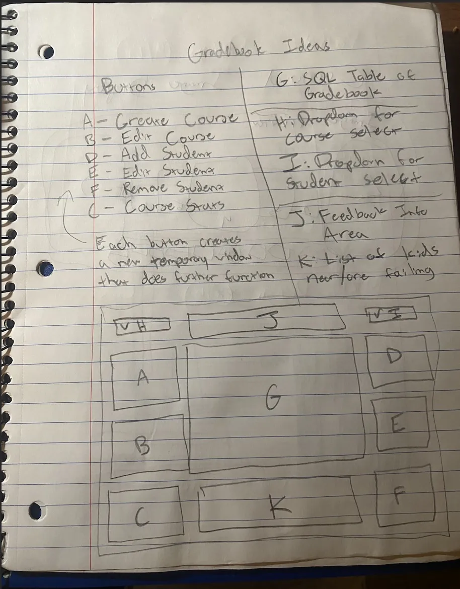
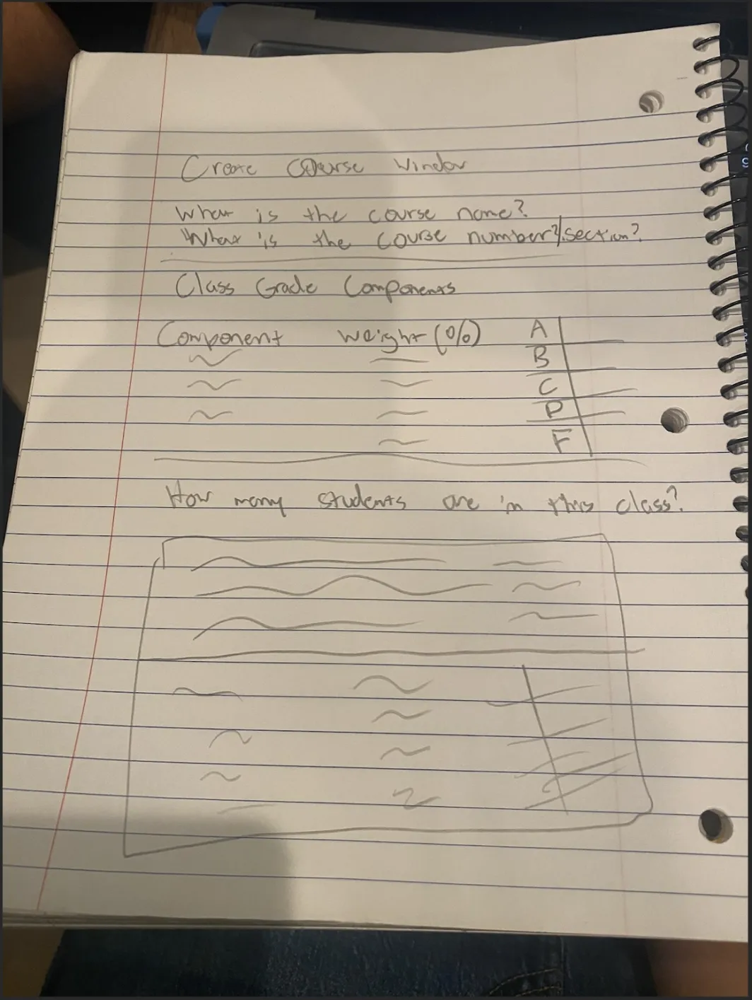

# GradebookGUI

Starting off as a group project, I solely handled the responsibility of developing the code for this project. My colleagues handled the remaining responsibilities such as the Instruction Manual and Presentation.

Gradebook.py is the main file. Records.sqlite3 handles all data.

<a href="images/Project JMJM Instruction Manual.pdf">View the Instruction Manual</a>

Below are images pertaining to the ideation process.

